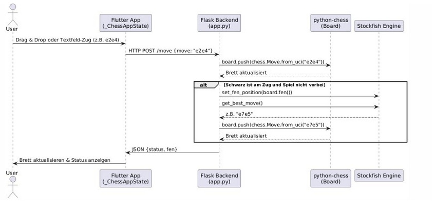

# Schach-App Dokumentation

## Überblick

Diese Schach-App besteht aus einem **Client** und einem **Server**.  
Der Benutzer interagiert über ein **Flutter-Frontend**, das ein Schachbrett mit Schachfiguren darstellt.

### Spielzug-Eingabe

Der Benutzer kann Züge auf zwei Arten eingeben:

1. **Texteingabe**  
   Beispiel: Um den Königsbauern von `e2` nach `e4` zu bewegen, gibt man einfach `e2e4` ein.
2. **Drag and Drop**  
   Figuren können per Ziehen auf das gewünschte Feld bewegt werden.

### Server-Logik

- Die vom Frontend übermittelte Eingabe wird an den Server (`app.py`) weitergeleitet.
- Dieser verarbeitet den Zug über die Bibliothek **Python Chess**.
- Ist der Spieler nicht am Zug, wird das Board an die Schach-Engine **Stockfish** übergeben.
- Über die Methode `get_best_move()` wird der beste Zug von Stockfish ermittelt.
- Dieser wird wiederum ans Backend und anschließend ans Frontend weitergeleitet.

> *Siehe auch das Sequenzdiagramm zur Veranschaulichung.*

---

## Schwierigkeitsstufen und Neustart

Die App ermöglicht einen Neustart mit unterschiedlichen Schwierigkeitsgraden.  
Beim Klick auf den jeweiligen Button wird ein neues Spiel mit dem entsprechenden Skill-Level gestartet:

| Schwierigkeitsgrad | Stockfish SkillLevel |
|--------------------|----------------------|
| Easy               | 5                    |
| Mid                | 10                   |
| Hard               | 15                   |
| Very Hard          | 20                   |

---

## Technologien

- **Server:**  
  - Python  
  - Flask  
  - Python Chess (für Zugvalidierung)
  
- **Client:**  
  - Flutter  
  - Dart

- **Schach-Engine:**  
  - Stockfish

---

## App ausführen

### Server starten
-Zum Sever Navigieren
-cd chess_server

pip install -r requirements.txt
python app.py
