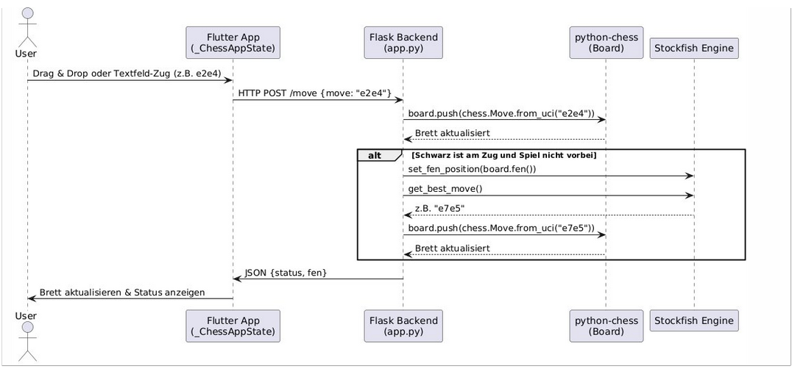

# Web_dev_chess

## Einleitung

**Web_dev_chess** ist ein umfassendes Schach-Webprojekt, das es ermöglicht, direkt im Browser gegen einen Computergegner Schach zu spielen. Das Projekt besteht aus zwei zentralen Komponenten: einem leistungsfähigen Python-Backend, das die gesamte Spiellogik und die Kommunikation mit der Schachengine Stockfish übernimmt, sowie einem modernen Frontend, das mit Flutter entwickelt wurde und eine intuitive, responsive Benutzeroberfläche bereitstellt. Ziel dieses Projekts ist es, eine Plattform zu schaffen, auf der Nutzer unabhängig von ihrem Endgerät und Betriebssystem ein vollständiges Schacherlebnis genießen können. Die KI basiert auf der weltweit anerkannten Engine Stockfish, deren Schwierigkeitsgrad individuell angepasst werden kann, sodass sowohl Anfänger als auch erfahrene Spieler gefordert werden.

---

## Gesamtarchitektur und Komponenten

### Das Backend: Spiellogik, Engine-Anbindung und API

Das Backend von **Web_dev_chess** ist in Python geschrieben und nutzt das Web-Framework Flask. Es ist für die gesamte Spiellogik verantwortlich und stellt die Schnittstelle zwischen dem Frontend und der Schachengine Stockfish dar. Die wichtigsten Aufgaben des Backends sind:

- Verwaltung des aktuellen Spielstands, der in der sogenannten FEN-Notation gespeichert wird. FEN steht für "Forsyth-Edwards Notation" und ermöglicht es, jede beliebige Schachstellung eindeutig als Text darzustellen.
- Überprüfung und Ausführung von Spielzügen. Das Backend prüft, ob ein vom Nutzer eingegebener Zug legal ist, und führt ihn gegebenenfalls aus.
- Kommunikation mit der Stockfish-Engine. Sobald der Nutzer einen Zug gemacht hat und der Computer am Zug ist, wird die aktuelle Stellung an Stockfish übergeben. Die Engine berechnet daraufhin den besten Zug, der dann automatisch ausgeführt wird.
- Bereitstellung einer REST-API, über die das Frontend neue Spiele starten, Züge senden und den aktuellen Spielstand abfragen kann.
- Auslieferung der statischen Dateien des Flutter-Frontends, sodass die gesamte Anwendung über einen einzigen Server erreichbar ist.

Das Backend verwendet folgende Bibliotheken und Tools:

- **Flask:** Ein leichtgewichtiges Web-Framework, das die Definition von HTTP-Endpunkten und die Verarbeitung von Anfragen ermöglicht.
- **Flask-CORS:** Ein Zusatzmodul, das Cross-Origin Resource Sharing erlaubt. Dadurch kann das Frontend, das möglicherweise auf einer anderen Domain oder einem anderen Port läuft, problemlos mit dem Backend kommunizieren.
- **python-chess:** Eine umfangreiche Bibliothek, die die gesamte Schachlogik abbildet, Züge prüft, das Brett verwaltet und Spielenden erkennt.
- **stockfish:** Ein Python-Binding für die Stockfish-Engine, das die Kommunikation mit der Engine über das UCI-Protokoll ermöglicht.

### Das Frontend: Benutzeroberfläche und Nutzerinteraktion

Das Frontend von **Web_dev_chess** ist mit Flutter entwickelt, einem modernen Framework von Google, das die Entwicklung von plattformübergreifenden Anwendungen ermöglicht. Das Frontend läuft als Web-App, kann aber auch als Desktop- oder Mobile-App gebaut werden. Die wichtigsten Funktionen des Frontends sind:

- Darstellung eines responsiven Schachbretts, das sich automatisch an die Bildschirmgröße anpasst. Die Figuren werden als Unicode-Symbole angezeigt, was eine plattformunabhängige und leichtgewichtige Darstellung ermöglicht.
- Unterstützung von Drag & Drop sowie Texteingabe für Züge. Nutzer können Figuren per Maus oder Touch verschieben oder Züge direkt als Text eingeben.
- Anzeige von Statusmeldungen, wie zum Beispiel, wer am Zug ist, ob ein Fehler aufgetreten ist oder ob das Spiel beendet wurde.
- Buttons zum Starten neuer Spiele mit verschiedenen Schwierigkeitsgraden, sodass der Nutzer jederzeit die Herausforderung anpassen kann.
- Kommunikation mit dem Backend über HTTP. Das Frontend sendet Züge an das Backend, fragt den aktuellen Spielstand ab und startet neue Spiele über die bereitgestellten REST-Endpunkte.

Das Frontend verwendet folgende Pakete:

- **http:** Für die Kommunikation mit dem Backend über REST-API.
- **flutter_chess_board:** Optional, für eine noch komfortablere Darstellung und Interaktion mit dem Schachbrett.
- **socket_io_client:** Optional, für zukünftige Erweiterungen wie Multiplayer oder Echtzeit-Updates.

---

## Detaillierte Funktionsweise

### Spielstart und Initialisierung

Beim Start der Anwendung wird automatisch ein neues Schachspiel mit einem voreingestellten Schwierigkeitsgrad gestartet. Das Frontend sendet dazu eine Anfrage an den `/new`-Endpunkt des Backends und übergibt den gewünschten Schwierigkeitsgrad für die Stockfish-Engine. Das Backend setzt das Schachbrett auf die Startposition zurück und initialisiert die Engine mit den entsprechenden Parametern. Der Nutzer kann jederzeit ein neues Spiel beginnen und dabei den Schwierigkeitsgrad individuell anpassen.

### Zugabwicklung und Spielfluss

Der Nutzer kann einen Zug entweder durch Ziehen einer Figur auf dem Schachbrett oder durch Eingabe des Zuges im UCI-Format (z.B. "e2e4") machen. Sobald ein Zug eingegeben wurde, sendet das Frontend diesen an das Backend. Das Backend prüft, ob der Zug legal ist. Ist dies der Fall, wird der Zug ausgeführt und das Backend prüft, ob das Spiel dadurch beendet wurde (z.B. durch Schachmatt, Patt oder Remis). Falls das Spiel noch nicht vorbei ist und der Computer am Zug ist, wird die aktuelle Stellung an die Stockfish-Engine übergeben. Die Engine berechnet daraufhin den besten Zug, der dann ebenfalls ausgeführt wird. Das Backend gibt anschließend den neuen Spielstand im FEN-Format an das Frontend zurück, das daraufhin das Schachbrett aktualisiert.


### Spielende und Statusanzeigen

Das Backend erkennt automatisch, wenn das Spiel vorbei ist. Dies kann durch Schachmatt, Patt, Aufgabe, Remis durch die 50-Züge-Regel oder dreifache Stellungswiederholung geschehen. Das Frontend zeigt dem Nutzer den aktuellen Status an und informiert ihn über das Spielende. Der Nutzer kann anschließend ein neues Spiel starten oder die Partie analysieren.

---

## Technologien und Bibliotheken im Detail

### Backend

- **Python 3:** Die Programmiersprache, in der das Backend geschrieben ist. Python eignet sich besonders gut für schnelle Entwicklung und bietet zahlreiche Bibliotheken für Schach und Webentwicklung.
- **Flask:** Ein minimalistisches Web-Framework, das die Definition von HTTP-Endpunkten und die Verarbeitung von Anfragen erleichtert.
- **python-chess:** Eine leistungsfähige Bibliothek, die die gesamte Schachlogik abbildet, Züge prüft, das Brett verwaltet und Spielenden erkennt.
- **stockfish:** Ein Python-Binding für die Stockfish-Engine, das die Kommunikation mit der Engine über das UCI-Protokoll ermöglicht.
- **Flask-CORS:** Ein Zusatzmodul, das Cross-Origin Resource Sharing erlaubt und somit die Kommunikation zwischen Frontend und Backend ermöglicht.

### Frontend

- **Flutter:** Ein modernes Framework von Google, das die Entwicklung von plattformübergreifenden Anwendungen ermöglicht. Mit Flutter kann das Frontend sowohl als Web-App als auch als Desktop- oder Mobile-App gebaut werden.
- **http:** Ein Paket für die Kommunikation mit dem Backend über REST-API.
- **flutter_chess_board:** Optional, für eine komfortable Darstellung und Interaktion mit dem Schachbrett.
- **socket_io_client:** Optional, für zukünftige Erweiterungen wie Multiplayer oder Echtzeit-Updates.

---

## Projektstruktur und Aufbau

Das Projekt ist in zwei Hauptverzeichnisse unterteilt: `chess_sever` für das Backend und `flutter_chess_frontend` für das Frontend. Die wichtigsten Dateien und Verzeichnisse sind:

```
Web_dev_chess/
│
├── chess_sever/
│   ├── app.py                # Haupt-Backend-Logik (Flask)
│   ├── requirements.txt      # Python-Abhängigkeiten
│   └── stockfish/
│       └── stockfish/        # Stockfish-Binary und ggf. Source
│
└── flutter_chess_frontend/
    ├── lib/
    │   ├── main.dart         # Haupt-Frontend-Logik
    │   └── utils.dart        # Hilfsfunktionen (z.B. FEN-Parser)
    ├── pubspec.yaml          # Flutter-Abhängigkeiten
    └── build/web/            # Generiertes Web-Frontend (wird von Flask ausgeliefert)
```

---

## REST-API: Endpunkte und Datenformate

Das Backend stellt eine Reihe von REST-Endpunkten bereit, über die das Frontend mit dem Server kommuniziert. Die wichtigsten Endpunkte sind:

### `/new` (POST)

Mit diesem Endpunkt kann ein neues Spiel gestartet werden. Der Nutzer kann optional den Schwierigkeitsgrad für die Stockfish-Engine angeben.

**Beispiel-Request:**
```json
{
  "skillLevel": 10
}
```

**Beispiel-Response:**
```json
{
  "status": "new game started"
}
```

### `/board` (GET)

Dieser Endpunkt gibt den aktuellen Spielstand zurück, einschließlich der FEN-Notation, des Spielstatus und wer am Zug ist.

**Beispiel-Response:**
```json
{
  "fen": "rnbqkbnr/pppppppp/8/8/8/8/PPPPPPPP/RNBQKBNR w KQkq - 0 1",
  "is_game_over": false,
  "turn": "white"
}
```

### `/move` (POST)

Über diesen Endpunkt kann ein Zug an das Backend gesendet werden. Der Zug muss im UCI-Format angegeben werden.

**Beispiel-Request:**
```json
{
  "move": "e2e4"
}
```

**Beispiel-Response (bei Erfolg):**
```json
{
  "status": "ok",
  "fen": "rnbqkbnr/pppppppp/8/8/4P3/8/PPPP1PPP/RNBQKBNR b KQkq - 0 1"
}
```

**Beispiel-Response (bei Fehler):**
```json
{
  "status": "illegal move"
}
```
oder
```json
{
  "status": "invalid move",
  "error": "Fehlermeldung"
}
```

---

## Installation und Inbetriebnahme

### Voraussetzungen

Um das Projekt lokal auszuführen, werden folgende Voraussetzungen benötigt:

- **Python 3.8 oder höher**
- **Flutter** (für das Frontend)
- **Stockfish**-Binary (liegt im Projekt bei oder kann von der offiziellen Webseite heruntergeladen werden)

### Backend installieren und starten

1. Wechsle ins Backend-Verzeichnis:
   ```sh
   cd chess_sever
   ```
2. Installiere die Python-Abhängigkeiten:
   ```sh
   pip install -r requirements.txt
   ```
3. Starte den Flask-Server:
   ```sh
   python app.py
   ```
   Der Server läuft dann auf `http://localhost:8000`.

### Frontend bauen und starten

1. Wechsle ins Frontend-Verzeichnis:
   ```sh
   cd flutter_chess_frontend
   ```
2. Installiere die Flutter-Abhängigkeiten:
   ```sh
   flutter pub get
   ```
3. Baue das Web-Frontend:
   ```sh
   flutter build web
   ```
   Die gebauten Dateien liegen dann in `build/web` und werden vom Flask-Server ausgeliefert.

4. Öffne im Browser:  
   [http://localhost:8000](http://localhost:8000)

---

## Erweiterungsmöglichkeiten und Ausblick

Das Projekt ist so aufgebaut, dass es leicht erweitert und angepasst werden kann. Mögliche Erweiterungen sind:

- **Multiplayer-Modus:** Durch die Integration von WebSockets im Backend und entsprechende Anpassungen im Frontend kann ein Mehrspielermodus realisiert werden, bei dem zwei Nutzer gegeneinander spielen können.
- **Benutzerverwaltung:** Die Implementierung von Registrierung, Login und Speicherung von Spielständen ermöglicht es, Nutzerprofile anzulegen und Partien zu speichern.
- **Analyse-Modus:** Durch die Integration zusätzlicher Analysefunktionen kann der Nutzer die Stellung bewerten lassen, Varianten berechnen oder Fehler in seinen Zügen aufdecken.
- **Erweiterte Brettdarstellung:** Die Verwendung von SVG-Grafiken oder animierten Figuren kann das Spielerlebnis weiter verbessern.
- **Mobile- und Desktop-Apps:** Da das Frontend mit Flutter entwickelt wurde, kann die Anwendung mit wenigen Anpassungen auch als native App für Android, iOS, Windows, Mac und Linux bereitgestellt werden.

---

## Lizenz und rechtliche Hinweise

Dieses Projekt ist ein Beispielprojekt und kann beliebig angepasst und erweitert werden. Für die Nutzung von Stockfish gelten die Bedingungen der GPLv3. Bitte beachte die Lizenzbedingungen, wenn du das Projekt weiterverbreitest oder kommerziell nutzt.

---

## Weiterführende Links und Ressourcen

- [Stockfish Engine](https://stockfishchess.org/)
- [python-chess](https://python-chess.readthedocs.io/)
- [Flutter](https://flutter.dev/)
- [UCI-Protokoll](https://backscattering.de/chess/uci/)

---

## Herangehnsweise
Alles begann mit der Planung. Bevor ich überhaupt mit der technischen Umsetzung starten konnte, musste ich mir zunächst im Klaren darüber sein, was genau das Projekt werden sollte. Ursprünglich hatte ich die Idee, ein Schachspiel im Player-vs-Player-Modus zu entwickeln, bei dem sich zwei Clients mit einem zentralen Server verbinden und gegeneinander spielen können. Nach intensiver Recherche und unter der Berücksichtigung, dass ich das Projekt alleine realisiere, entschied ich mich schließlich dazu, das Spiel als PvE (Player versus Environment) umzusetzen – also gegen eine KI statt gegen andere menschliche Spieler. Diese Entscheidung ermöglichte es mir, den Fokus auf die Spielmechanik und KI-Integration zu legen, ohne mich mit der zusätzlichen Komplexität eines Netzwerk-Backends beschäftigen zu müssen. Anfangs überlegte ich noch, das Backend mit Dart umzusetzen. Nach weiterer Recherche entschied ich mich jedoch für Python als Programmiersprache. Der ausschlaggebende Grund war die leistungsstarke Bibliothek python-chess, die viele komplexe Aufgaben – wie etwa die Validierung von Zügen – bereits zuverlässig übernimmt. Außerdem ließ sich die Schach-Engine Stockfish sehr einfach in Python integrieren, was mir zusätzliche Entwicklungsschritte ersparte. Mit diesen Entscheidungen im Gepäck erstellte ich einen groben Projektplan. Ich definierte, welche Funktionen ich umsetzen wollte und wie das Endergebnis ungefähr aussehen sollte. Anschließend begann ich mit der Entwicklung – in einem iterativen Prozess, bei dem ich das Projekt Schritt für Schritt weiterentwickelte. In der ersten Version des Spiels war es noch nicht möglich, selbst Züge zu machen – stattdessen wurde automatisch immer derselbe Zug ausgeführt (e2 nach e4). Danach entwickelte ich ein Eingabefeld, über das die Spieler manuell Züge eingeben konnten. Allerdings stellte sich schnell heraus, dass diese Art der Steuerung auf Dauer unpraktisch und wenig benutzerfreundlich war. Deshalb baute ich ein Drag-and-Drop-Feld ein, über das die Figuren intuitiv bewegt werden können. Bis zu diesem Zeitpunkt war es möglich, sowohl die weißen als auch die schwarzen Figuren zu bewegen. Diese Funktion war insbesondere in der Entwicklungsphase äußerst hilfreich, da ich neue Features – wie beispielsweise das Drag-and-Drop-System – unkompliziert integrieren und direkt testen konnte. Im nächsten Schritt integrierte ich die Stockfish-Engine, die es dem Spieler ermöglicht, gegen einen starken Computergegner anzutreten. An dieser Stelle war das Projekt eigentlich schon funktional abgeschlossen. Allerdings merkte ich schnell, dass die Engine selbst auf niedrigster Einstellung sehr stark spielte. Daher entschloss ich mich, verschiedene Schwierigkeitsgrade einzubauen.

---

## Fazit
Alles in allem war dieses Projekt für mich eine äußerst spannende und lehrreiche Erfahrung. Ich konnte nicht nur meine technischen Fähigkeiten weiterentwickeln, sondern auch wichtige Erkenntnisse im Bereich der Projektplanung und -durchführung gewinnen. Es traten zwischendurch einige Problem auf wie das ich mein erstes Projekt aufgrund unzureichender Planung vollständig verwerfen musste. Dadurch konnte ich erkennen wie wichtige eine gute Planung ist, auch im einzel Projekt, und habe das Projekt nochmal gut geplant angefangen. Natürlich gibt es auch noch einige Schwachstellen und Verbesserungspotenzial. Manche Features, die ich gerne noch umgesetzt hätte, konnten aus Zeitgründen nicht mehr realisiert werden. Auch kleinere Fehler oder nicht vollständig ausgereifte Komponenten hätte ich mit mehr Zeit gerne noch optimiert. Zusammengefasst hat das Projekt einen guten Einblick in die web Entwicklung gegeben und mich Motiviert mehr damit zu Arbeiten.


So und nachdem ihr diese viel zu lange Beschreibung gelesen habt wünsche ich euch viel Spaß beim Schach spielen ;)